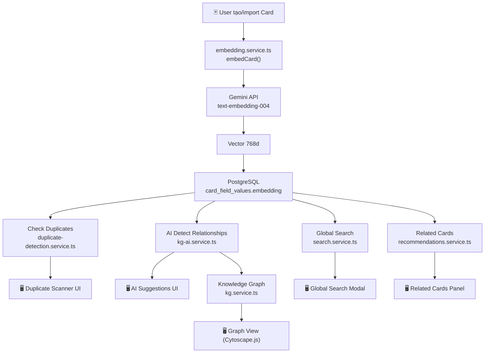

# AI Embedding Features — Giải thích Chi tiết cho Người mới

> **Tài liệu này:** Giải thích tất cả các tính năng AI Embedding đã triển khai trong Engram Spira, viết cho người chưa biết gì về project hay công nghệ bên trong. Senior sẽ cầm tay chỉ việc cho bạn từ A→Z.

---

## Mục lục

1. [Nền tảng: Embedding là gì?](#1-nền-tảng-embedding-là-gì)
2. [Kiến trúc tổng thể hệ thống AI Embedding](#2-kiến-trúc-tổng-thể-hệ-thống-ai-embedding)
3. [Embedding Service — Trái tim của hệ thống](#3-embedding-service--trái-tim-của-hệ-thống)
4. [Check Duplicates — Phát hiện thẻ trùng lặp](#4-check-duplicates--phát-hiện-thẻ-trùng-lặp)
5. [AI Detect Relationships — Phát hiện quan hệ giữa các thẻ](#5-ai-detect-relationships--phát-hiện-quan-hệ-giữa-các-thẻ)
6. [Knowledge Graph — Đồ thị Kiến thức](#6-knowledge-graph--đồ-thị-kiến-thức)
7. [Global Search — Tìm kiếm ngữ nghĩa](#7-global-search--tìm-kiếm-ngữ-nghĩa)
8. [Related Cards Panel — Thẻ liên quan khi học](#8-related-cards-panel--thẻ-liên-quan-khi-học)
9. [Lịch sử thay đổi: Tại sao bị sửa đi sửa lại?](#9-lịch-sử-thay-đổi-tại-sao-bị-sửa-đi-sửa-lại)
10. [Phân tích vấn đề còn tồn tại](#10-phân-tích-vấn-đề-còn-tồn-tại)

---

## 1. Nền tảng: Embedding là gì?

### Giải thích đơn giản

Hãy tưởng tượng mỗi flashcard trong hệ thống là **một điểm trong không gian**. Embedding là cách chúng ta "biến văn bản thành tọa độ" — một mảng số (vector) đại diện cho **ý nghĩa** của văn bản đó.

```
"Apple" → [0.12, -0.34, 0.56, ..., 0.78]   (768 số)
"Quả táo" → [0.11, -0.33, 0.55, ..., 0.77]  (768 số — gần giống!)
"Xe hơi" → [0.91, 0.22, -0.67, ..., 0.01]  (768 số — khác hoàn toàn!)
```

**Ý tưởng cốt lõi:** Hai câu có **ý nghĩa giống nhau** sẽ có vector **gần nhau** trong không gian 768 chiều — dù chúng viết bằng ngôn ngữ khác nhau hay dùng từ khác nhau.

### Các công nghệ liên quan

| Công nghệ | Vai trò | Giải thích |
|---|---|---|
| **Gemini `text-embedding-004`** | Tạo embedding | Model AI của Google, nhận text → trả về vector 768 chiều |
| **pgvector** | Lưu & tìm kiếm vector | Extension của PostgreSQL, thêm kiểu dữ liệu `vector` và các phép tính khoảng cách |
| **HNSW Index** | Tăng tốc tìm kiếm | Thuật toán "gần đúng láng giềng gần nhất" — tìm vector giống nhất trong ~5-20ms |
| **Cosine Similarity** | Đo độ giống nhau | Công thức toán đo góc giữa 2 vector. Giá trị từ 0 (hoàn toàn khác) đến 1 (giống hệt) |

### Matryoshka Embeddings — Tại sao 768 chứ không phải 3072?

Gemini `text-embedding-004` mặc định tạo vector **3072 chiều** (3072 số), nhưng chúng ta chỉ dùng **768 chiều** — cắt bớt 2/3. Đây gọi là **Matryoshka truncation** (giống búp bê Matryoshka lồng nhau):

- **3072d**: Chính xác nhất nhưng tốn 4x dung lượng storage + index chậm hơn
- **768d**: Vẫn đủ chính xác cho use case của chúng ta, tiết kiệm đáng kể bộ nhớ và tốc độ

File cấu hình: [embedding.service.ts](file:///home/tplong/WorkSpace/engram_spira/apps/api/src/modules/embedding/embedding.service.ts#L11)

```typescript
const EMBEDDING_DIMENSIONS = 768;
```

---

## 2. Kiến trúc tổng thể hệ thống AI Embedding

### Sơ đồ data flow



### Cấu trúc thư mục backend

```
apps/api/src/modules/
├── embedding/
│   ├── embedding.service.ts    ← Core: tạo/lưu/tìm kiếm vector
│   └── embedding.routes.ts     ← API: GET /status, POST /backfill
├── ai/
│   ├── ai.service.ts           ← AI Card Factory (tạo thẻ từ text)
│   ├── ai.routes.ts            ← API: /ai/* (generate, check-duplicates, deck-duplicates)
│   └── duplicate-detection.service.ts  ← Check Duplicates logic
├── knowledge-graph/
│   ├── kg.service.ts           ← CRUD links, graph data, concepts
│   ├── kg-ai.service.ts        ← AI phát hiện quan hệ + trích khái niệm
│   └── kg.routes.ts            ← API: /knowledge-graph/*
└── search/
    ├── search.service.ts       ← Semantic search + text fallback
    └── search.routes.ts        ← API: GET /search
```

### Cấu trúc thư mục frontend

```
apps/web/src/components/
├── deck-view/
│   ├── duplicate-scanner.tsx   ← Nút "Check Duplicates" + kết quả
│   ├── ai-suggestions.tsx      ← Nút "AI Detect Relationships" + gợi ý
│   ├── graph-view.tsx          ← Đồ thị Knowledge Graph (Cytoscape.js)
│   └── retention-heatmap.tsx   ← Heatmap khả năng ghi nhớ
├── search/
│   └── global-search.tsx       ← Modal tìm kiếm toàn cục
└── study/
    └── related-cards-panel.tsx  ← Thẻ liên quan khi nhấn "Again"
```

---

## 3. Embedding Service — Trái tim của hệ thống

> File: [embedding.service.ts](file:///home/tplong/WorkSpace/engram_spira/apps/api/src/modules/embedding/embedding.service.ts)

Đây là service trung tâm — mọi tính năng AI khác đều phụ thuộc vào nó.

### 3.1. Tạo Embedding cho một Card

**Bài toán:** Một card có nhiều field (front, back, IPA, examples...). Làm sao "tóm tắt" toàn bộ thành **1 vector duy nhất**?

**Giải pháp:**

```
Card "Hello"
├── front: "Hello"        ← side=front, sortOrder=0
├── back: "Xin chào"      ← side=back, sortOrder=0  
├── ipa: "/həˈloʊ/"       ← side=back, sortOrder=1
└── examples: "Hello World" ← side=back, sortOrder=2

→ Nối lại: "Hello Xin chào /həˈloʊ/ Hello World"
→ Gọi Gemini API: text → vector 768d
→ Lưu vào card_field_values.embedding (dòng đầu tiên của card)
```

Hàm [getCardText()](file:///home/tplong/WorkSpace/engram_spira/apps/api/src/modules/embedding/embedding.service.ts#L72-L102) nối tất cả field value, **front trước, back sau** (để ưu tiên từ khóa tìm kiếm).

Hàm [embedCard()](file:///home/tplong/WorkSpace/engram_spira/apps/api/src/modules/embedding/embedding.service.ts#L109-L128) gọi `generateEmbedding()` rồi lưu vào **dòng `card_field_values` đầu tiên** của card đó.

### 3.2. Fire-and-Forget Pattern

```typescript
export function enqueueEmbedding(cardId: string): void {
  embedCard(cardId).catch((err) =>
    embLogger.warn({ cardId, err }, 'Failed to generate embedding for card'),
  );
}
```

**Ý nghĩa:** Khi user tạo card, hệ thống gọi `enqueueEmbedding()` — chạy embedding ở **background**, **không chặn** response trả về cho user. Nếu thất bại, chỉ log warning, **không throw error** — vì việc tạo card không được bị block bởi embedding.

### 3.3. Batch Backfill

Hàm [backfillEmbeddings()](file:///home/tplong/WorkSpace/engram_spira/apps/api/src/modules/embedding/embedding.service.ts#L173-L272):

- Tìm tất cả card **chưa có embedding** 
- Xử lý từng batch 50 cards
- Gọi `batchEmbedContents()` — **1 API call cho 50 texts** (thay vì 50 API calls)
- Nghỉ 200ms giữa các batch để không block event loop
- Trigger qua API: `POST /embedding/backfill`

### 3.4. Vector Search

Hàm [searchByEmbedding()](file:///home/tplong/WorkSpace/engram_spira/apps/api/src/modules/embedding/embedding.service.ts#L287-L330):

```sql
SELECT
  c.id AS card_id,
  c.deck_id AS deck_id,
  1 - (cfv.embedding <=> '[0.12, -0.34, ...]'::vector) AS similarity
FROM card_field_values cfv
JOIN cards c ON cfv.card_id = c.id
JOIN decks d ON c.deck_id = d.id
WHERE d.user_id = $userId
  AND cfv.embedding IS NOT NULL
ORDER BY cfv.embedding <=> '[...]'::vector
LIMIT 20
```

- `<=>` là **cosine distance operator** của pgvector
- `1 - distance = similarity` (0→1, càng cao càng giống)
- HNSW index giúp tìm kiếm **~5-20ms** trên 100K vectors
- Threshold mặc định: `0.5` (lọc những kết quả có similarity < 50%)

### 3.5. Lưu Vector — Tại sao dùng Raw SQL?

```typescript
async function storeEmbedding(cfvId: string, embedding: number[]): Promise<void> {
  const vectorLiteral = `[${embedding.join(',')}]`;
  await pgClient`
    UPDATE card_field_values
    SET embedding = ${vectorLiteral}::vector
    WHERE id = ${cfvId}
  `;
}
```

> **Tại sao không dùng Drizzle ORM?** Vì Drizzle's `sql.raw()` chokes (bị lỗi) trên string vector ~6KB (768 số × 8 bytes). postgres-js client xử lý parameterized queries ở bất kỳ kích thước nào.

---

## 4. Check Duplicates — Phát hiện thẻ trùng lặp

> File: [duplicate-detection.service.ts](file:///home/tplong/WorkSpace/engram_spira/apps/api/src/modules/ai/duplicate-detection.service.ts)  
> Frontend: [duplicate-scanner.tsx](file:///home/tplong/WorkSpace/engram_spira/apps/web/src/components/deck-view/duplicate-scanner.tsx)

### Bài toán

User tạo nhiều card, đặc biệt qua AI Card Factory. Dẫn đến tình huống:
- Card A: "What is photosynthesis?"  
- Card B: "Describe the process of photosynthesis"  
→ **Khác câu chữ, nhưng cùng khái niệm** — cần phát hiện!

### 3 chế độ hoạt động

#### Chế độ 1: Check by Card ID
```
POST /ai/check-duplicates
Body: { cardId: "uuid" }
```
- Lấy embedding có sẵn của card (đã lưu trong DB)
- Nếu card chưa có embedding → tạo mới từ text
- Tìm top 5 card giống nhất (threshold ≥ 0.85)

#### Chế độ 2: Check by Text  
```
POST /ai/check-duplicates
Body: { text: "What is photosynthesis?", excludeCardId: "uuid" }
```
- Dùng để check **trước khi tạo card** — chưa có cardId
- Tạo embedding từ text nhập vào → tìm trong DB
- `excludeCardId` để loại trừ chính card đang edit

#### Chế độ 3: Scan toàn bộ Deck
```
POST /ai/deck-duplicates
Body: { deckId: "uuid", threshold: 0.95 }
```
- Lấy **tất cả embeddings** trong deck (raw SQL query)
- So sánh **từng cặp** (pairwise) — O(N²/2)
- Safety limit: **max 500 cards** (500 × 499 / 2 = 124,750 so sánh)
- Trả về danh sách cặp trùng lặp + labels

### Frontend: Duplicate Scanner

```
[Check Duplicates] ← Nút trong deck-view
        ↓ click
POST /ai/deck-duplicates { deckId, threshold: 0.95 }
        ↓
┌─────────────────────────────────────────┐
│ ⚠️ 3 potential duplicates found         │
│                                          │
│ "Hello" ↔ "Hi there"           98%      │
│ "Thank you" ↔ "Thanks"         96%      │
│ "Goodbye" ↔ "Bye bye"          95%      │
└─────────────────────────────────────────┘
```

Threshold frontend mặc định là `0.95` (rất cao — chỉ phát hiện gần giống hệt).

### Error Handling: `rethrowIfMissingEmbedding`

```typescript
function rethrowIfMissingEmbedding(err: unknown): never {
  const code = cause?.code ?? (err as { code?: string })?.code;
  if (code === '42703') {  // PostgreSQL: "undefined_column"
    throw new AppError(422, 'Embedding data is not available yet...');
  }
  throw err;
}
```

**Tại sao cần cái này?** Nếu migration 0022 chưa chạy (chưa có cột `embedding`), PostgreSQL sẽ throw error code `42703`. Thay vì hiển thị lỗi kỹ thuật, ta trả 422 với message thân thiện.

---

## 5. AI Detect Relationships — Phát hiện quan hệ giữa các thẻ

> File: [kg-ai.service.ts](file:///home/tplong/WorkSpace/engram_spira/apps/api/src/modules/knowledge-graph/kg-ai.service.ts)  
> Frontend: [ai-suggestions.tsx](file:///home/tplong/WorkSpace/engram_spira/apps/web/src/components/deck-view/ai-suggestions.tsx)

### Bài toán

Trong deck "IELTS Vocabulary" có 200 cards. Một số cards có **quan hệ ngữ nghĩa** với nhau:
- "import" và "export" → liên quan (related)
- "verb" và "noun" → liên quan
- "prefix" là tiên quyết cho "un-prefix words" → prerequisite

Thay vì user tự nối từng cặp (cực kỳ tedious), AI tự phát hiện.

### Cách hoạt động

```
POST /knowledge-graph/ai/detect
Body: { deckId: "uuid", threshold: 0.7 }
```

**Quy trình (flow) bên trong:**

```
1. Verify ownership (deck thuộc user?)
2. Fetch tất cả embeddings trong deck (raw SQL)
3. Safety limit: cắt ở 500 cards
4. Half-matrix comparison:
   ┌──────────────────────────────┐
   │ Card A vs Card B → sim 0.82 │  ← i < j only (không so ngược)
   │ Card A vs Card C → sim 0.45 │  ← < threshold → bỏ qua
   │ Card B vs Card C → sim 0.75 │  ← ≥ threshold → candidate!
   │ ...                         │
   └──────────────────────────────┘
5. Fetch existing card_links → lọc bỏ cặp đã link
6. Fetch card labels (front field text) cho display
7. Sort by similarity desc, limit top 20
8. Return suggestions[]
```

### So sánh với Check Duplicates

| Đặc điểm | Check Duplicates | AI Detect Relationships |
|---|---|---|
| **Mục đích** | Tìm card **gần giống hệt** | Tìm card **có liên quan** |
| **Threshold mặc định** | 0.85-0.95 (rất cao) | 0.7 (trung bình) |
| **Kết quả** | Cặp trùng lặp (nên xóa 1) | Gợi ý link (nên tạo quan hệ) |
| **Output** | `pairs[]` với similarity | `suggestions[]` với suggestedType |
| **Lọc existing** | Không lọc | Lọc bỏ cặp đã có trong `card_links` |

### Auto Concept Extraction

Hàm [extractConcepts()](file:///home/tplong/WorkSpace/engram_spira/apps/api/src/modules/knowledge-graph/kg-ai.service.ts#L152-L196):

```
Card text: "Photosynthesis is the process by which plants convert sunlight into energy"
     ↓ Gemini LLM
["photosynthesis", "plants", "sunlight", "energy conversion", "biology"]
     ↓ Save to card_concepts table
```

- Dùng **Gemini LLM** (model chính, không phải embedding model) để trích 2-5 khái niệm
- Lưu vào bảng `card_concepts` (lowercase, onConflictDoNothing)
- Được gọi fire-and-forget trong embedding pipeline

### Frontend: AI Suggestions

```
[AI Detect Relationships] ← Nút trong deck-view
        ↓ click
POST /knowledge-graph/ai/detect { deckId, threshold: 0.7 }
        ↓
┌──────────────────────────────────────────────┐
│ ✨ 5 relationships suggested                  │
│                                    [Accept All]│
│ "import" → "export"    related  82% [✓] [×]  │
│ "verb"   → "noun"      related  78% [✓] [×]  │
│ ...                                           │
└──────────────────────────────────────────────┘
```

- **Accept (✓):** Gọi `POST /knowledge-graph/links` → tạo link trong DB → invalidate graph query
- **Dismiss (×):** Chỉ xóa khỏi UI (local state), không lưu vào DB
- **Accept All:** Tuần tự accept từng suggestion

---

## 6. Knowledge Graph — Đồ thị Kiến thức

> File: [kg.service.ts](file:///home/tplong/WorkSpace/engram_spira/apps/api/src/modules/knowledge-graph/kg.service.ts)  
> Routes: [kg.routes.ts](file:///home/tplong/WorkSpace/engram_spira/apps/api/src/modules/knowledge-graph/kg.routes.ts)  
> Frontend: [graph-view.tsx](file:///home/tplong/WorkSpace/engram_spira/apps/web/src/components/deck-view/graph-view.tsx)

### Tổng quan

Knowledge Graph biến các thẻ flashcard từ **danh sách phẳng** thành **mạng lưới kiến thức** có cấu trúc. Mỗi thẻ = 1 node, mỗi quan hệ = 1 edge.

### Database Schema

**Bảng `card_links`:**
```sql
CREATE TABLE card_links (
  id UUID PRIMARY KEY,
  source_card_id UUID REFERENCES cards(id) ON DELETE CASCADE,
  target_card_id UUID REFERENCES cards(id) ON DELETE CASCADE,
  link_type VARCHAR(20) DEFAULT 'related',  -- 'related' | 'prerequisite'
  created_at TIMESTAMP DEFAULT NOW(),
  UNIQUE(source_card_id, target_card_id),
  CHECK (source_card_id != target_card_id)  -- No self-link
);
```

**Bảng `card_concepts`:**
```sql
CREATE TABLE card_concepts (
  id UUID PRIMARY KEY,
  card_id UUID REFERENCES cards(id) ON DELETE CASCADE,
  concept VARCHAR(255),
  created_at TIMESTAMP DEFAULT NOW()
);
```

### API Endpoints (6 endpoints)

| Method | Path | Chức năng |
|---|---|---|
| `POST` | `/knowledge-graph/links` | Tạo link giữa 2 cards |
| `DELETE` | `/knowledge-graph/links/:id` | Xóa link |
| `GET` | `/knowledge-graph/cards/:id/links` | Lấy links của 1 card |
| `GET` | `/knowledge-graph/decks/:id/graph` | Lấy data đồ thị (nodes + edges) |
| `GET` | `/knowledge-graph/search?q=...` | Tìm card để link (ILIKE search) |
| `POST` | `/knowledge-graph/ai/detect` | AI phát hiện quan hệ |
| `POST` | `/knowledge-graph/cards/:id/concepts` | Thêm concepts cho card |
| `GET` | `/knowledge-graph/cards/:id/concepts` | Xem concepts của card |

### getDeckGraph() — Cách tạo data cho biểu đồ

Hàm [getDeckGraph()](file:///home/tplong/WorkSpace/engram_spira/apps/api/src/modules/knowledge-graph/kg.service.ts#L154-L279) thực hiện:

```
1. Lấy tất cả cards trong deck
2. Parallel fetch (Promise.all):
   ├── Field values (labels cho nodes)
   ├── Study progress (retention cho màu nodes)
   └── Card links (edges)
3. Tính retention: R(t) = e^(-t/S)
   - t = số ngày từ lần review cuối
   - S = stability (FSRS) hoặc intervalDays × easeFactor/2.5 (SM-2)
4. Return { nodes[], edges[] }
```

**Retention color coding:**
- 🟢 ≥ 80%: Nhớ tốt
- 🟡 ≥ 60%: Cần ôn
- 🔴 < 60%: Sắp quên

### Frontend: Graph View (Cytoscape.js)

File [graph-view.tsx](file:///home/tplong/WorkSpace/engram_spira/apps/web/src/components/deck-view/graph-view.tsx) dùng **Cytoscape.js** (thay vì d3-force ban đầu được đề xuất trong roadmap):

- **Layout:** `cose` (Compound Spring Embedder) — tự sắp xếp node đẹp mắt
- **Node:** Hình tròn, màu theo retention, label = front field text (cắt ở 20 ký tự)
- **Edge prerequisite:** Đường tím liền, có mũi tên (→)
- **Edge related:** Đường xám nét đứt, không mũi tên
- **Tương tác:** Hover → tooltip, Click node → highlight connected, Click nền → reset
- **Zoom/Pan:** Cho phép zoom 0.3x–3x

**Trạng thái empty:**
- Cards có nhưng chưa có links → Hiện "No relationships yet. Use AI Detect Relationships below"
- Chỉ render khi `edges.length > 0` (chỉ hiện connected nodes)

---

## 7. Global Search — Tìm kiếm ngữ nghĩa

> File: [search.service.ts](file:///home/tplong/WorkSpace/engram_spira/apps/api/src/modules/search/search.service.ts)

### Chiến lược Dual Search

```
User gõ: "process of making food from light"
     ↓
┌─ Semantic Search ──────────────────────────┐
│ 1. Tạo embedding cho query (~50ms)         │
│ 2. pgvector cosine search (~5-20ms)        │
│ 3. Enrich kết quả với fields + deck names  │
│ ✓ Tìm "photosynthesis" dù không match text │
└────────────────────────────────────────────┘
     ↓ Nếu thất bại hoặc 0 kết quả
┌─ Text Search (Fallback) ──────────────────┐
│ ILIKE '%query%' trên card_field_values     │
│ Chỉ tìm exact text match                   │
└────────────────────────────────────────────┘
```

**Graceful degradation:** Nếu embedding service bị lỗi (API key hết hạn, pgvector chưa cài...), hệ thống tự fallback sang text search. User không thấy lỗi.

---

## 8. Related Cards Panel — Thẻ liên quan khi học

> File: [related-cards-panel.tsx](file:///home/tplong/WorkSpace/engram_spira/apps/web/src/components/study/related-cards-panel.tsx)

### Use case

Khi user học (study mode) và nhấn **"Again"** (quên), panel hiện ra danh sách **thẻ liên quan**:

```
┌─ Related cards (3) ─────────────────────┐
│ 🔗 "import" · IELTS Vocab · related    │
│ ✨ "trade" · IELTS Vocab · 82%          │
│ ✨ "commerce" · Business · 75%          │
└─────────────────────────────────────────┘
```

- 🔗 = Link đã tồn tại trong `card_links` (source: `link`)
- ✨ = AI tìm bằng embedding similarity (source: `semantic`)

### API call

```
GET /study/recommendations/:cardId?limit=5
```

Backend kết hợp 2 nguồn:
1. **Explicit links** từ `card_links` table
2. **Semantic matches** từ embedding search

---

## 9. Lịch sử thay đổi: Tại sao bị sửa đi sửa lại?

> **Đây là phần quan trọng nhất** — giúp bạn hiểu tại sao Check Duplicates và AI Detect Relationships bị thay đổi liên tục.

### Timeline: "Thêm → Xóa → Thêm lại" embedding infrastructure

#### Lần 1: Thêm embedding (Migration 0011)

**Commit khoảng Phase 2 ban đầu**
```sql
-- Migration 0011_pgvector_embeddings.sql
CREATE EXTENSION IF NOT EXISTS vector;
ALTER TABLE card_field_values ADD COLUMN embedding vector(768);
CREATE INDEX idx_cfv_embedding ON card_field_values USING hnsw (embedding vector_cosine_ops);
```

**Ý định ban đầu:** Dùng pgvector để powering duplicate detection. Nhưng **chưa có code backend nào** sử dụng cột này — chỉ tạo schema rồi bỏ đấy.

#### Lần 2: XÓA embedding (Migration 0015)

**Commit `8947457` — 10/03/2026**
```sql
-- Migration 0015_drop_embedding_column.sql
DROP INDEX IF EXISTS idx_cfv_embedding;
ALTER TABLE card_field_values DROP COLUMN IF EXISTS embedding;
```

**Lý do xóa:**
- Cột `embedding` đã tạo nhưng **không ai dùng** — zero backend code
- Không có service nào tạo embedding cho cards
- Feature roadmap đã đánh dấu "AI Duplicate Detection: ❌ — embedding đã bị xóa"
- Quyết định: dọn dẹp schema thay vì để dead column

> **Bài học:** Đừng tạo infrastructure trước khi cần. Migration 0011 tạo cột nhưng không có code dùng nó → nợ kỹ thuật → phải dọn dẹp.

#### Lần 3: THÊM LẠI embedding (Migration 0022 + commits 4fdcf75, 782eff1, 7d7d575, 4f00537)

**Commits 19/03/2026** — Chuỗi 4 commits liên tiếp (**~6,300 dòng thay đổi!**)

| Commit | Mô tả | Nội dung chính |
|---|---|---|
| `4fdcf75` | Mega commit: implement analytics suite & global search | 53 files, +6307/-81 lines. Tạo toàn bộ: embedding service, duplicate detection, knowledge graph, search, forecast, recommendations + frontend tương ứng |
| `782eff1` | Fix error handling cho missing embedding column | Thêm `rethrowIfMissingEmbedding()` — khi DB chưa có cột embedding, trả 422 thay vì 500 |
| `7d7d575` | Fix migration journal | Migration 0022 thiếu trong meta journal → Drizzle không nhận ra |
| `4f00537` | Optimize pgvector operations + Graph View rewrite | Chuyển Graph View từ d3-force sang Cytoscape.js. Fix Drizzle choke on large vectors bằng raw pgClient queries. Thêm Matryoshka 768d config |

**Migration 0022 (version cuối cùng):**
```sql
CREATE EXTENSION IF NOT EXISTS vector;
ALTER TABLE card_field_values ADD COLUMN IF NOT EXISTS embedding vector(768);
CREATE INDEX IF NOT EXISTS idx_cfv_embedding
  ON card_field_values USING hnsw (embedding vector_cosine_ops)
  WITH (m = 16, ef_construction = 64);
```

> **Khác biệt vs Migration 0011:** Thêm `WITH (m=16, ef_construction=64)` — tham số HNSW tối ưu cho < 1M vectors.

### Tại sao Check Duplicates sửa đi sửa lại?

**Vấn đề gặp phải (theo thứ tự thời gian):**

| # | Vấn đề | Giải pháp | Commit |
|---|---|---|---|
| 1 | Tạo cột embedding nhưng không code gì | Xóa cột (Migration 0015) | `8947457` |
| 2 | Cần triển khai đúng → tạo lại toàn bộ từ đầu | Implement đầy đủ: service + routes + frontend | `4fdcf75` |
| 3 | Drizzle ORM choke trên vector string 6KB+ | Chuyển sang raw `pgClient` tagged template | `4f00537` |
| 4 | Nếu cột embedding chưa tồn tại → crash 500 | Thêm `rethrowIfMissingEmbedding()` → 422 user-friendly | `782eff1` |
| 5 | Migration 0022 thiếu trong journal | Fix journal file | `7d7d575` |
| 6 | Scan O(N²) chậm trên deck lớn | Thêm safety limit 500 cards + parse vectors upfront | `4f00537` |

### Tại sao AI Detect Relationships sửa đi sửa lại?

**Ban đầu đề xuất dùng LLM (Gemini) scan toàn bộ deck text** → Rất chậm, tốn API quota.

**Giải pháp hiện tại:** Dùng **embedding similarity thuần túy** (pure vector math), **không gọi LLM**:
- Performance: ~20-50ms cho 100-card deck (thay vì vài giây nếu dùng LLM)
- Zero API cost cho detection (chỉ cần embedding đã tạo sẵn)
- Trade-off: Không phân biệt được `prerequisite` vs `related` — mặc định gán `related` cho tất cả

**Commit `4f00537` rewrite:**
- Di chuyển from nguyên bản LLM-based approach sang pure embedding cosine similarity
- Tối ưu half-matrix comparison (chỉ so i < j, bỏ qua i ≥ j vì symmetric)
- Deduplicate bằng canonical key (`a:b` where a < b)
- Lọc bỏ existing links từ `card_links` table

---

## 10. Phân tích vấn đề còn tồn tại

### 10.1. Check Duplicates — Vấn đề hiện tại

#### ⚠️ Vấn đề 1: O(N²) pairwise comparison không scale

**Trong `scanDeckDuplicates()`:**
```typescript
const limitedRows = rows.slice(0, 500);  // Safety limit
for (let i = 0; i < parsed.length; i++) {
  for (let j = i + 1; j < parsed.length; j++) {
    const sim = cosineSimilarity(vecA, vecB);  // O(768) mỗi lần
  }
}
```

**Vấn đề:** 
- 500 cards → 124,750 lần so sánh × 768 operations = ~95 triệu phép tính
- Cards > 500 bị **cắt bỏ hoàn toàn** mà không thông báo user
- Nếu deck 1000 cards thì chỉ scan 500 đầu tiên

**Giải pháp tiềm năng:** Dùng pgvector `ORDER BY embedding <=> target LIMIT N` cho mỗi card (tận dụng HNSW index, O(N log N) thay vì O(N²))

#### ⚠️ Vấn đề 2: Embedding chỉ lưu trên 1 field value row

```typescript
const [firstField] = await db
  .select({ id: cardFieldValues.id })
  .from(cardFieldValues)
  .where(eq(cardFieldValues.cardId, cardId))
  .limit(1);

await storeEmbedding(firstField.id, embedding);
```

**Vấn đề:** 
- Embedding được gán cho **dòng `card_field_values` đầu tiên** (không kiểm soát thứ tự)
- Nếu card bị edit → embedding cũ vẫn nằm đó (stale)
- Không có cơ chế **re-embed khi card thay đổi**

#### ⚠️ Vấn đề 3: Duplicate function trùng lặp code

`getCardText()` xuất hiện ở **2 nơi** giống hệt:
- [embedding.service.ts#L72](file:///home/tplong/WorkSpace/engram_spira/apps/api/src/modules/embedding/embedding.service.ts#L72)
- [duplicate-detection.service.ts#L238](file:///home/tplong/WorkSpace/engram_spira/apps/api/src/modules/ai/duplicate-detection.service.ts#L238)

`getCardLabels()` xuất hiện ở **2 nơi** giống hệt:
- [duplicate-detection.service.ts#L260](file:///home/tplong/WorkSpace/engram_spira/apps/api/src/modules/ai/duplicate-detection.service.ts#L260)
- [kg-ai.service.ts#L200](file:///home/tplong/WorkSpace/engram_spira/apps/api/src/modules/knowledge-graph/kg-ai.service.ts#L200)

`cosineSimilarity()` xuất hiện ở **2 nơi** giống hệt:
- [duplicate-detection.service.ts#L299](file:///home/tplong/WorkSpace/engram_spira/apps/api/src/modules/ai/duplicate-detection.service.ts#L299)
- [kg-ai.service.ts#L237](file:///home/tplong/WorkSpace/engram_spira/apps/api/src/modules/knowledge-graph/kg-ai.service.ts#L237)

→ Cần extract ra shared utility module.

### 10.2. AI Detect Relationships — Vấn đề hiện tại

#### ⚠️ Vấn đề 1: Tất cả đều gán `suggestedType: 'related'`

```typescript
suggestions.push({
  ...
  suggestedType: 'related',  // Mặc định toàn bộ!
});
```

**Vấn đề:** Không bao giờ gợi ý `prerequisite`. Logic phân biệt "Card A là tiên quyết cho Card B" vs "Card A và B liên quan" **chưa được triển khai**.

**Tại sao:** Cosine similarity chỉ biết "2 cards giống nhau bao nhiêu", không biết **hướng quan hệ** (A → B hay B → A) hay **loại quan hệ** (related vs prerequisite).

**Giải pháp tiềm năng:** Dùng LLM (Gemini) để phân loại một bước nữa: gửi cặp card text cho LLM hỏi "Is A a prerequisite for B, or just related?"

#### ⚠️ Vấn đề 2: Dismissed suggestions không được nhớ

Khi user nhấn **Dismiss (×)** một suggestion:
```typescript
const handleDismiss = (suggestion: Suggestion) => {
  setSuggestions((prev) => prev.filter(...));  // Chỉ xóa khỏi local state
};
```

**Vấn đề:** Suggestions đã dismiss sẽ **xuất hiện lại** khi user click "AI Detect Relationships" lần sau. Không có bảng `dismissed_suggestions` trong DB.

#### ⚠️ Vấn đề 3: Giống Check Duplicates - O(N²)

Cùng pattern pairwise comparison, cùng safety limit 500 cards, cùng vấn đề scalability.

### 10.3. Knowledge Graph — Vấn đề đáng chú ý

#### 🔴 Vấn đề 1: Prerequisite chain chưa ảnh hưởng study mode

Trong roadmap ban đầu:
> "Chuỗi tiên quyết bắt buộc thứ tự học — thẻ B sẽ không xuất hiện để ôn tập cho đến khi thẻ A được thành thạo"

**Hiện tại:** Study endpoint (`GET /study/deck/:deckId`) **KHÔNG lọc card dựa trên prerequisite chains**. `link_type: 'prerequisite'` chỉ là label hiển thị, không enforce thứ tự học.

→ Đây là tính năng core của Knowledge Graph mà **chưa triển khai**.

#### 🟡 Vấn đề 2: Graph chỉ hiện connected nodes

```typescript
const connectedIds = new Set<string>();
for (const e of data.edges) {
  connectedIds.add(e.source);
  connectedIds.add(e.target);
}
const connectedNodes = data.nodes.filter((n) => connectedIds.has(n.id));
```

**Vấn đề:** Nếu deck 200 cards nhưng chỉ 10 cards có links, graph chỉ hiện 10 nodes. User **không thấy 190 cards còn lại** — tưởng deck gần trống.

**Giải pháp tiềm năng:** Hiện tất cả nodes nhưng nodes không connected có opacity thấp hơn, hoặc cho toggle "Show all cards" / "Show connected only".

#### 🟡 Vấn đề 3: Không có link types đầy đủ

Roadmap đề xuất 4 loại: `related_to`, `prerequisite_of`, `opposite_of`, `example_of`.  
Hiện tại chỉ có **2 loại**: `related` và `prerequisite`.

#### 🟡 Vấn đề 4: Concept extraction chưa kết nối

`card_concepts` table có data (từ `extractConcepts()`), nhưng:
- Không có UI hiển thị concepts
- Không dùng concepts cho search hay recommendations
- Bảng `card_concepts` **chưa có cột embedding** — nên concept-level semantic similarity chưa khả thi

#### 🟡 Vấn đề 5: Không có manual link UI trong card detail

Trong roadmap: "Card detail → Link to... search + add"  
**Hiện tại:** Chỉ có AI auto-detect. **Không có UI** cho user tự tìm và tạo link thủ công từ trang chi tiết card.

Backend đã sẵn sàng (endpoint `POST /knowledge-graph/links` + `GET /knowledge-graph/search?q=...`), nhưng frontend chưa có form/modal để user tạo link.

#### 🟡 Vấn đề 6: Graph visualization limitations

- **Không responsive:** Container height cố định `360px`
- **Không có nút zoom controls**: Phải dùng scroll/pinch
- **Tooltip bị cắt:** Position tính từ rendered position, có thể bị cắt ở mép container
- **Không zoom-to-fit:** Khi data lớn, user phải zoom thủ công
- **Performance:** 500+ nodes với cose layout có thể chậm trên thiết bị yếu

### 10.4. Database & Migration Issues

#### ⚠️ Migration 0022 không graceful

Migration 0011 (bản cũ):
```sql
-- Graceful: skip nếu pgvector không có
DO $$ BEGIN
  CREATE EXTENSION IF NOT EXISTS vector;
EXCEPTION WHEN OTHERS THEN
  RAISE NOTICE 'pgvector extension not available, skipping';
END $$;
```

Migration 0022 (bản mới):
```sql
-- KHÔNG graceful: crash nếu pgvector không có
CREATE EXTENSION IF NOT EXISTS vector;
ALTER TABLE card_field_values ADD COLUMN IF NOT EXISTS embedding vector(768);
```

**Vấn đề:** Nếu server PostgreSQL không cài pgvector extension, migration 0022 sẽ **fail hard** thay vì skip gracefully. Migration 0011 đã làm đúng với `EXCEPTION WHEN OTHERS THEN ...` nhưng 0022 bỏ qua pattern này.

---

## Tổng kết

### Trạng thái các tính năng AI Embedding

| Tính năng | Backend | Frontend | Trạng thái |
|---|:---:|:---:|---|
| **Embedding Service** | ✅ | N/A | Hoạt động đầy đủ |
| **Backfill Embeddings** | ✅ | N/A (API only) | Hoạt động |
| **Check Duplicates** | ✅ | ✅ | Hoạt động, cần tối ưu O(N²) |
| **AI Detect Relationships** | ✅ | ✅ | Hoạt động, luôn gán `related` |
| **Knowledge Graph CRUD** | ✅ | Partial (chỉ qua AI) | Thiếu manual link UI |
| **Knowledge Graph View** | ✅ | ✅ (Cytoscape.js) | Hoạt động, chỉ hiện connected |
| **Prerequisite Chains** | ❌ | ❌ | Chưa triển khai |
| **Global Search** | ✅ | ✅ | Hoạt động với fallback |
| **Related Cards Panel** | ✅ | ✅ | Hoạt động |
| **Concept Extraction** | ✅ | ❌ | Backend có, frontend chưa hiển thị |

### Ưu tiên sửa đề xuất

| # | Vấn đề | Mức độ | Effort |
|---|---|---|---|
| 1 | Refactor code trùng lặp (getCardText, cosineSimilarity, getCardLabels) | 🟢 Dễ | 1-2h |
| 2 | Re-embed khi card bị edit | 🟡 Trung bình | 2-4h |
| 3 | Migration 0022 thêm graceful degradation | 🟢 Dễ | 30 phút |
| 4 | Manual link UI trong card detail | 🟡 Trung bình | 1-2 ngày |
| 5 | Prerequisite chain enforce trong study mode | 🟠 Khó | 2-3 ngày |
| 6 | O(N²) → pgvector-based approach cho scan deck | 🟡 Trung bình | 1 ngày |
| 7 | Thêm suggestedType logic (LLM classify) | 🟡 Trung bình | 1 ngày |
| 8 | Dismissed suggestions persistence | 🟢 Dễ | 2-4h |
